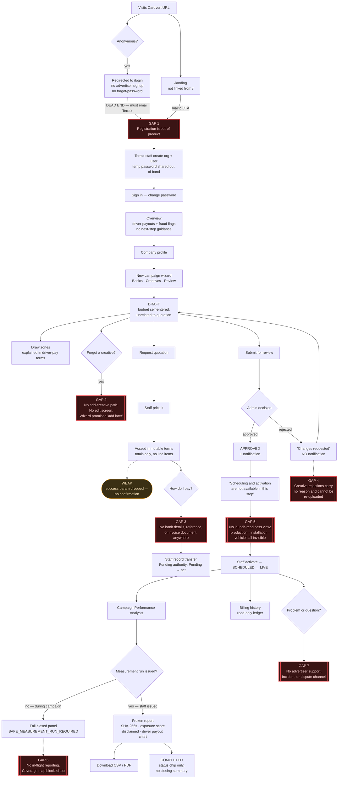

Read-only audit complete. No files modified.

---

# Cardvert — Advertiser Journey Comprehension Audit
**Snapshot:** working tree at `3832cff` (HEAD `25925e2`) · read-only · no tests run
**Verdict:** A new advertiser **cannot** complete the journey without staff coaching. Three stages (registration, funding, creative repair) have no in-product path at all; the reporting stage is written for Terrax engineers.

---

## 1. Advertiser journey map

| # | Stage | In-product? | Who acts | Advertiser can see state? |
|---|---|---|---|---|
| 1 | Discover | `/landing` only — **not reachable from `/`** ([page.tsx:4](frontend/src/app/page.tsx:4) redirects anon → `/login`) | — | n/a |
| 2 | Register / org setup | **No.** Primary CTA is `mailto:` ([content.ts:34](frontend/src/app/landing/content.ts:34)); accounts created by staff ([users/new/page.tsx:19](frontend/src/app/admin/users/new/page.tsx:19) "Onboarding is operator-led") | Terrax | No |
| 3 | First sign-in | `/change-password` (temp password) | Advertiser | Yes |
| 4 | Company profile | `/advertiser/company` | Advertiser | Weak (no completeness state) |
| 5 | Create campaign | 3-step wizard → **draft** | Advertiser | Yes |
| 6 | Zones / target areas | `/campaigns/[id]/zones` | Advertiser | Yes |
| 7 | Quotation | Request → staff price → accept | Both | Partial |
| 8 | Funding / payment | **No path.** No bank details, reference, or invoice document anywhere | Terrax (admin records transfer) | Only after the fact |
| 9 | Creative submission | Wizard only | Advertiser | Yes |
| 10 | Approval / rejection | Staff decision; campaign reasons shown, **creative reasons never** | Terrax | Asymmetric |
| 11 | Launch readiness | **No view.** Production/installation/assignment gates are admin-only | Terrax | No |
| 12 | Activation | Admin-only | Terrax | Status chip only |
| 13 | Progress / exposure | Blocked until staff issue a measurement run | Terrax | No in-flight report |
| 14 | Invoices / payments | `/advertiser/billing` — read-only ledger | Terrax | Partial |
| 15 | Support / disputes | **None exist for advertisers** (disputes are driver-only) | — | No |
| 16 | Completion | Status `completed`; no closing summary or final invoice moment | Terrax | Chip only |

---

## 2. Screen-by-screen comprehension findings

**`/login`** — Only outbound link is "Want to drive with us? Start an application". A brand arriving at the product URL sees a driver funnel and no advertiser path, no signup, and **no "Forgot password"** (grep: zero matches in `app/login`, `components/auth`).

**`/advertiser` (Overview)** — Six stats, three of which are Terrax-internal: *Driver campaign cost* ("Payout projection — not advertiser spend"), *Open fraud flags* ("Auto-pulled from billable inventory"), *Model confidence diagnostic* ("Formula diagnostic, not a statistical confidence interval"). No next-step, no pending-action, no funding state. [page.tsx:31-62](frontend/src/app/advertiser/page.tsx:31)

**`/campaigns/new`** — Header promises "targeting zones come next"; the action redirects straight to the detail page and never mentions zones again ([actions.ts:75](frontend/src/app/advertiser/campaigns/new/actions.ts:75)). Asks for a **Total budget** with no explanation of how it relates to the quotation the advertiser will actually be billed. No creative specs (size, resolution, bleed) for a vehicle wrap. Upload progress renders raw phase strings — `hashing…`, `uploading…`, `scanning…` ([wizard.tsx:349](frontend/src/app/advertiser/campaigns/new/wizard.tsx:349)). "Daily cap" here vs "Daily budget" on the detail page.

**`/campaigns/[id]`** — Densest comprehension failure. "Immutable server-recorded submission and decision history", "Submitted snapshot SHA-256: …", creative meta showing `security scan: pending` and `legacy URL (not launch-authoritative)`, creative status printed as the raw enum (`ready`, `archived` — both grey, indistinguishable). Approved state says only *"Scheduling and activation are not available in this step"* — build-phase language that names no owner and no next step.

**Commercial terms panel** — "Immutable quotation, funding and production facts" / **"Accept immutable terms"** with only net+VAT+gross visible. `QuoteRevisionRead.line_items`, `payment_terms`, `production_cost_amount`, `production_scope` are all returned by the API and **none are rendered**. Below acceptance: `authority_type.replaceAll("_"," ")` → *"prepaid cash"*, `authority_basis` → raw, `budget_evaluations…state` → raw. "Record expedited waiver" is unexplained.

**`/campaigns/[id]/zones`** — Every explanation is written from the **driver payout** side: "Target zones carry premium driver time, bonus zones add driver incentive". Nothing states what a zone costs the advertiser or does for reach. Zone geometry cannot be edited after saving (rename/retype only) and this is never said.

**`/campaigns/[id]/report`** — Titled "Campaign Performance Analysis", but the page shows: "Frozen measurement authority · no client recalculation", a `reproducible` chip, `Run <uuid>`, `result <sha16>… · proof <sha16>… · report <sha16>…`, "governed trips", raw `active_tracking_seconds`, and `impressions_v1`. The headline **Exposure score** carries the hint: *"Synthetic uncalibrated operational index; not an impression estimate, audience count, statistical confidence interval or attribution result."* The flagship number is defined entirely by what it is not. A full daily chart is devoted to **driver payouts**.

**Fail-closed states** — `GovernedAnalysisState` prints the raw code (`SAFE_MEASUREMENT_RUN_REQUIRED`, `MEASUREMENT_LIVE_ISSUANCE_BLOCKED`) plus the label "Fail-closed reporting state", and instructs *"Issue a new governed measurement run after correcting the source authority"* — an action only Terrax staff can take, addressed to the advertiser.

**`/advertiser/planning-sources`** — Staff-grade screen sitting third in the advertiser nav. Raw `source_type` as a heading, full SHA-256 "Evidence" strings, `Campaign <uuid>` / `Target zone <uuid>`, "stale parent state", "All cells are suppressed by the current disclosure floor", "Download controlled CSV", raw `coverage_cell` ids. No sentence explains what a planning source is or why to create one.

**`/advertiser/billing`** — "Canonical receipts, lifecycle events and accepted-term allocations". Empty state: "No canonical receipts have been recorded." Unallocated payment reads "Unapplied — does not authorize production" with no remedy. Closing line — *"Online payment checkout is unavailable until an approved provider is configured. Manual bank-transfer evidence remains the canonical supported path"* — is a deployment note, and it is the **only** payment guidance in the product.

---

## 3. Missing or misleading states — confirmed defects

Ranked; all code-verified, separated from taste.

| # | Finding | Evidence |
|---|---|---|
| **D1** | **No way to add a creative after campaign creation.** The wizard explicitly says *"you can create the campaign without creatives and add them later"* — `POST …/creatives` is called **only** from the wizard. That campaign can never receive artwork. | [wizard.tsx:379](frontend/src/app/advertiser/campaigns/new/wizard.tsx:379) vs sole caller [new/actions.ts:55](frontend/src/app/advertiser/campaigns/new/actions.ts:55) |
| **D2** | **No campaign edit screen exists.** `PATCH /advertiser/campaigns/{id}` is unused by the frontend; no `[campaignId]/edit` route. Name and description can never be changed, even on a draft. | route listing; `api.PATCH` only appears in `zones/actions.ts` and `company/actions.ts` |
| **D3** | **Detail page points at that nonexistent screen:** *"Upload a private creative file when you edit this campaign."* | [page.tsx:284](frontend/src/app/advertiser/campaigns/[campaignId]/page.tsx:284) |
| **D4** | **A rejected creative cannot be fixed.** `PATCH …/creatives/{id}` unused → "Resubmit creative" re-sends the identical rejected asset. | [creative-status-actions.tsx:31](frontend/src/app/advertiser/campaigns/[campaignId]/creative-status-actions.tsx:31) |
| **D5** | **Creative rejection reason is never shown.** `GET …/creatives/{id}/review-history` exists for advertisers and is called by **no** advertiser screen (only the admin equivalent, in `admin/approvals`). Advertiser sees a red chip and nothing else. | [admin/approvals/page.tsx:44](frontend/src/app/admin/approvals/page.tsx:44) is the only caller |
| **D6** | **Rejection sends no notification.** `CAMPAIGN_APPROVED` is emitted on approval; the rejection branch emits none. No creative approve/reject notification exists at all. The state most needing a nudge is the silent one. | [campaigns.py:485-495](app/services/campaigns.py:485) |
| **D7** | **Success confirmations are silently dropped.** `requestQuoteAction` / `acceptQuoteAction` / `acceptExpeditedWaiverAction` redirect with `?quote_requested=1`, `?quote_accepted=1`, `?waiver_recorded=1`; the page's `searchParams` type reads **only** `commercial_error`. Accepting a quotation produces no confirmation. | [commercial-actions.ts:28,41,60](frontend/src/app/advertiser/campaigns/[campaignId]/commercial-actions.ts:28) vs [page.tsx:47](frontend/src/app/advertiser/campaigns/[campaignId]/page.tsx:47) |
| **D8** | **"Accept immutable terms" with no itemisation.** `line_items` is on the wire and never rendered — contradicting the landing promise that every quotation is itemised. | [commercial-panel.tsx:70-84](frontend/src/app/advertiser/campaigns/[campaignId]/commercial-panel.tsx:70); `QuoteRevisionRead.line_items` in `openapi.json` |
| **D9** | **"Preview and request change" performs no preview.** The action POSTs the change request immediately and returns "Campaign change recorded." `impact_preview` exists on `CampaignChangeRead` and is not rendered. | [actions.ts:139](frontend/src/app/advertiser/campaigns/[campaignId]/actions.ts:139) |
| **D10** | **Contradictory zone copy on one screen.** Page: exclusion zones *"are never billed"*. Radio hint: *"Never count modelled contacts here"*. Billing exclusion and measurement exclusion are different promises. | [zones/page.tsx:60](frontend/src/app/advertiser/campaigns/[campaignId]/zones/page.tsx:60) vs [zones-editor.tsx:36](frontend/src/app/advertiser/campaigns/[campaignId]/zones/zones-editor.tsx:36) |
| **D11** | **"🔥 Coverage map" / "Where campaign vehicles moved" shows no vehicle movement.** It renders the advertiser's own target-zone polygons ranked. `GET …/heatmap` is never called by the frontend (the file is *named* `heatmap-view.tsx`). | [map/page.tsx:100-112](frontend/src/app/advertiser/campaigns/[campaignId]/map/page.tsx:100) |
| **D12** | **"Contact support with the report status code"** — no code is rendered in that branch, and no advertiser support channel exists anywhere (nav, footer, or API). | [report-issuance-panel.tsx:250](frontend/src/app/advertiser/campaigns/[campaignId]/report/report-issuance-panel.tsx:250) |
| **D13** | **Target-area coverage is promised and not delivered.** The landing page lists it as one of three standard report rows, labelled *Measured*. The only implementation is `SCHEMA_VERSION = "synthetic-target-area-coverage-v1"`, status `SYNTHETIC_VALIDATION_ONLY`, `test_only: True`, on no advertiser route. The frozen result carries exactly three metrics, none of them coverage. | [content.ts REPORT.rows](frontend/src/app/landing/content.ts); [target_area_coverage.py:17-21](app/services/target_area_coverage.py:17); [measurement-authority.tsx:41-46](frontend/src/app/advertiser/campaigns/[campaignId]/report/measurement-authority.tsx:41) |
| **D14** | **No in-flight reporting.** Without a staff-issued measurement run, both Report and Coverage map return 503 fail-closed panels. During the live campaign the advertiser's two named deliverables are dead. | [reports.py:988-1012](app/services/reports.py:988) |
| **D15** | Notifications name no campaign and carry no link — *"Your campaign has been approved"* with several campaigns open is unactionable. | [notifications.py:98](app/api/v1/notifications.py:98); [notification-center.tsx:79](frontend/src/components/notifications/notification-center.tsx:79) |

**States the advertiser cannot distinguish**

- **Funded vs unfunded** — no campaign status covers it; funding lives only in the Commercial panel as `Funding authority: Pending`, with no definition of Pending.
- **Blocked** — no such state. A campaign stuck on missing production authority, missing installation evidence, or an unissued measurement run displays as plain `Approved`.
- **Approved (creative, ready) vs archived** — both render grey with the raw enum.
- **Paused-by-budget vs paused-by-ops** — one `Paused` chip; only a transient notification distinguishes them.
- **Completed** — no closing summary, final invoice, or reconciliation moment; the chip simply changes.

---

## 4. Recommended wording

Replacements only; no commercial or legal policy invented.

| Screen | Now | Suggested |
|---|---|---|
| Overview stat | "Driver campaign cost / Payout projection — not advertiser spend" | Remove from the advertiser surface, or relabel "Terrax delivery cost (not your invoice)" |
| Overview stat | "Open fraud flags / Auto-pulled from billable inventory" | "Delivery checks under review — we'll contact you if any affects your campaign" |
| Detail, approved | "Approved. Scheduling and activation are not available in this step." | "Approved. Terrax now schedules vehicles and arranges production. You'll be notified when your campaign goes live." |
| Detail, creatives empty | "Upload a private creative file when you edit this campaign." | "No artwork yet. Add a creative" (linking to a real screen — see §5) |
| Creative meta | "security scan: pending" / "legacy URL (not launch-authoritative)" | "Checking file…" / "Older upload — please re-upload before launch" |
| Review history | "Immutable server-recorded submission and decision history." | "Every submission and decision on this campaign, in order." Drop the SHA-256 line or place it behind "Verification details". |
| Commercial | "Immutable quotation, funding and production facts" | "Your quotation, payment and production status" |
| Commercial | "Accept immutable terms" | "Accept this quotation" — with line items above it and "Once accepted, the price and scope are fixed." |
| Commercial | "Operations will add a structured revision." | "Terrax is preparing your quotation. You'll be notified when it's ready to review." |
| Commercial | `Funding authority: Pending` | "Payment: not yet received" + the transfer instructions (see §5) |
| Commercial | `Production: Not authorised to start` | "Production starts once payment is confirmed and your artwork is approved." |
| Commercial | "Record expedited waiver" | Plain-language heading explaining what starting production before full payment means, then "I accept — start production now" |
| Zones | "Target zones carry premium driver time, bonus zones add driver incentive, and exclusion zones are never billed." | "**Target** — where you most want to be seen; vehicles are prioritised here. **Bonus** — additional priority areas. **Exclusion** — areas you never want your brand shown; time here is not counted or charged." (and make the radio hints match) |
| Report | "Frozen measurement authority · no client recalculation" | "Final results for [dates]. These figures are locked and cannot change." |
| Report | "Exposure score … Synthetic uncalibrated operational index; not an…" | Either explain what it *is* in one positive sentence, or remove it from the headline. A number defined only by negation reads as unreliable. |
| Report | "governed trips", "total sessions" | "campaign trips", "driving sessions" |
| Fail-closed | "An immutable measurement run must be issued before campaign results can be shown." + raw code | "Your final report isn't ready yet. Terrax prepares it after the campaign period closes." Move the code behind "Reference for support". |
| Billing | "No canonical receipts have been recorded." | "No payments recorded yet." |
| Billing | "Unapplied — does not authorize production" | "Received, not yet matched to a campaign — Terrax is reconciling it." |
| Billing | "Online payment checkout is unavailable until an approved provider is configured…" | "Pay by bank transfer. Card payment is coming soon." + actual instructions |
| Change panel | "Preview and request change" | "Request this change" (until a preview actually renders) |
| Wizard upload | `hashing…` / `uploading…` / `scanning…` | "Preparing file…" / "Uploading…" / "Checking file…" |
| Topbar | "Workspace" | Remove |

---

## 5. Recommended flow changes

1. **Give advertisers a front door.** Serve `/landing` (or an advertiser sign-up/enquiry page) to anonymous visitors at `/` instead of redirecting to `/login`; add "Sign in" to the landing header; add "Forgot password?" to the login form.
2. **Add a campaign edit screen** wired to the existing `PATCH /advertiser/campaigns/{id}`, available while `draft` or `rejected`, covering name, description, dates and budget. Reserve the change-request flow for post-approval changes only.
3. **Add creative management to the campaign page** — add, replace (`PATCH …/creatives/{id}`), and remove — so D1/D4 close and the wizard's "add them later" becomes true.
4. **Surface creative review history** on each creative row so a rejection shows its reason next to the fix.
5. **Notify on every decision the advertiser must act on**: campaign rejected, creative approved, creative rejected, quotation ready. Include the campaign name and a deep link.
6. **Render the quotation before acceptance** — line items, payment class, payment terms, production scope — then the accept button.
7. **Add a "How to pay" step** after acceptance, carrying the transfer instructions and reference the confirmed policy (D-log Q2/Q3) already assumes, plus a downloadable invoice.
8. **Add a launch-readiness checklist** on the campaign page: creative approved ✓/✗, payment received ✓/✗, vehicles assigned ✓/✗, installation approved ✓/✗ — sourced from the gates in `campaign_assignments.py`. This is the single highest-value addition; it replaces every "ask Terrax" moment between approval and go-live.
9. **Split live vs final reporting.** Keep a live progress view during the campaign (the `/summary` data already powers the detail stats) and reserve "Campaign Performance Analysis" for the frozen post-campaign run, so the fail-closed panel stops being the advertiser's main reporting experience.
10. **Add a support entry point** in the app shell — even a mailto to `terraxmediacompany@gmail.com` with campaign context prefilled would close D12.
11. **Move `Planning sources` behind a feature flag or explain it.** As shipped it is an internal tool in the primary advertiser nav.
12. **Remove driver-payout economics from advertiser surfaces** (Overview, campaign detail, report headline, daily chart, "additional driver liability").
13. **Add a completion moment** — a closing summary at `completed` linking the final report and final invoice.

---

## 6. Trust and transparency risks

1. **Cost confusion at commercial scale.** The advertiser's dashboard, campaign page and report headline all display *driver payouts* in Naira. An advertiser will read it as their spend, or as Terrax disclosing its margin. Both readings damage the relationship.
2. **A flagship metric defined by negation.** The Exposure score's own hint denies it is an impression estimate, an audience count, a confidence interval, or attribution. Honest, but on the headline it reads as "this number means nothing."
3. **Promise gap on target-area coverage.** Marketed as one of three standard *Measured* report rows; implemented only as `SYNTHETIC_VALIDATION_ONLY / test_only` and exposed nowhere. (D13)
4. **Promise gap on itemisation.** "every one of those costs is itemised in your quotation" — the acceptance screen shows three totals. (D8)
5. **Irreversible commitments with thin disclosure.** "Accept immutable terms", the expedited waiver, and "Cancel campaign permanently" are all one-click and all terminal. Cancellation warns that refund eligibility is determined elsewhere and then gives the advertiser no place to see it.
6. **Silence on rejection.** Approval notifies; rejection does not (D6), and creative rejections carry no reason (D5). The advertiser learns of a problem only by chance.
7. **Fraud language pointed at the customer.** "Open fraud flags" appears on the advertiser's own dashboard and report with no explanation and no way to ask about it.
8. **Cryptographic evidence without a purpose.** SHA-256 digests, run UUIDs and formula fingerprints appear on customer screens without saying what the advertiser should do with them. Intended as proof, they read as unfinished software.
9. **Blocked ≠ visible.** A campaign stalled on missing production authority or an unissued measurement run looks identical to a healthy approved campaign.

---

## 7. Prioritized fixes

**P0 — journey is broken without staff**
1. D1/D3 — creative add/replace after creation (unblocks any campaign created without artwork)
2. D5 + D6 — show creative rejection reasons; notify on all rejections
3. §5.7 — payment instructions and an invoice document
4. §5.8 — launch-readiness checklist
5. D7 — render the dropped success confirmations
6. D2 — campaign edit screen for draft/rejected

**P1 — misleading or unresolvable**
7. D8 — quotation line items before acceptance
8. D13 — deliver target-area coverage or remove the claim from the landing page
9. D12 + §5.10 — a support entry point
10. D9 — real preview, or rename the button
11. D14/§5.9 — live progress view separate from the frozen analysis
12. D11 — rename the coverage map, or wire the heatmap endpoint

**P2 — language and legibility**
13. Strip internal vocabulary: "immutable", "governed", "canonical", "frozen measurement authority", "fail-closed", "disclosure floor", "authority basis", raw enums, SHA-256s, UUIDs, raw error codes, `impressions_v1`
14. D10 — fix the contradictory exclusion-zone copy
15. Remove driver-payout economics from advertiser surfaces
16. D15 — name the campaign in notifications and link to it
17. §5.1 — advertiser front door, sign-in link, forgot-password
18. §5.11 — explain or hide Planning sources
19. Creative spec guidance in the wizard; consistent "Daily cap"/"Daily budget"; plain upload phases
20. §5.13 — a completion moment

---

## 8. Mermaid advertiser journey

---

**Scope note:** findings are limited to the advertiser-facing surfaces (`app/advertiser`, `app/login`, `app/landing`, `app/change-password`) and the API/service code backing them. Admin and driver flows were read only where they determine advertiser-visible state. No commercial or legal policy was inferred — §5.7 references the payment policy already recorded in `docs/decisions-log.md` (Q2/Q3) rather than proposing one.
