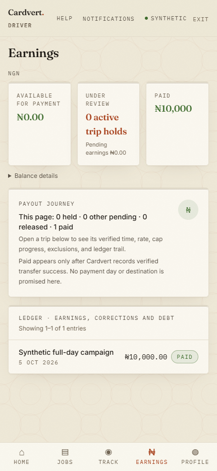

# W1-P payouts — local verification, 5 October 2026

Authority: `Cardvert_W1P_Payouts_Brief_2026-10-05.md`; approved/reviewed contract
`issues/planning/w1p-payouts-2026-10-05.md`. Branch `w1/payouts`, base
`750edbbc2ac7145781422f2bb283b78c06cb8289`. REQ-036/040/053 remain IN PROGRESS
until full CI and approved merge. No launch-queue, live-provider or deployment claim.

## Criterion evidence

| Criterion | Local verdict | Actual evidence |
| --- | --- | --- |
| 1. Full earnings, unchanged pay | PASS | `test_w1p_full_and_short_day_send_exact_earnings_without_fee_setup` passes both full ₦10,000 and proportional short-day cases through real calculation, reservation, intent processing and signed verified-success webhook replay. Adapter instruction, frozen line and paid ledger amounts equal the original earnings exactly; repeated processing is skipped; calculation fingerprint, saved day map and bound terms remain unchanged. Existing happy-path and `test_no_pay_calculation_changed_by_a_run` also pass. Source search found no transfer-fee implementation to remove and no fee setting, computation, field or display was introduced. Actual driver earnings UI below shows full paid amount using synthetic API responses. |
| 2. Dispute synchronization | PASS | Four PostgreSQL `test_w1p_dispute_and_automatic_authorization_serialize_on_postgres` cases cover run/claim and either winner, including an open dispute on another trip. Tests verify real waits with `pg_blocking_pids`; winning disputes prevent reservation/claim without provider calls, and a dispute after reservation causes final claim refusal. Two `test_w1p_dispute_reply_serializes_before_payout_check` cases cover real replies versus run/claim. Existing claim/run/pause and run/manual-reservation overlaps pass. Committed submission claim is the authorization boundary; this change promises no new protection for disputes arriving after that commit. |
| 3. Atomic sanitized alert audit | PASS | `test_w1p_alert_creation_audited_once_with_direct_subject`, PostgreSQL rollback/missing-actor and concurrent-alert cases pass: one deduplicated alert, one kind-only creation audit, directly affected driver subject, nullable missing actor, and rollback on notice failure. Concurrent creation exposed an existing omitted exact uniqueness diagnostic; the common allowlist now recognizes only that additional constraint, retaining rethrow for unrelated failures. Scoped helper diagnostics pass. |
| 4. Actor-only run subjects | PASS | `test_w1p_run_audit_stored_subject_is_actor_only` verifies persisted resolution has only the system actor, not the paid driver. Existing specific line/batch/alert resolver cases pass; alert stored target-subject regression passes. |
| 5. Bounded candidate fairness | PASS | Excluded-prefix regression uses different drivers and a one-entry admission cap; newer clean earnings are admitted while the older excluded entry remains available. Cursor regression uses a one-entry scan bound, equal timestamps, all-excluded runs, later eligibility, wrap, rollback and no duplicate reservation. Unchanged-limit deferral after wrap also passes. Production retains the 200-entry scan/lock bound and separate 200-entry admission cap; only finite-backlog progress is claimed. |
| 6. Cash attributed per day | PASS | Saved cross-midnight split and multiple adjacent cross-midnight trip cases pass. Existing same-day/manual/automatic cash excess checks pass. Missing/invalid allocations hold later earnings for a person. Real manual correction reservation without a calculation FK also holds the later automatic candidate instead of omitting that exposure. Frozen original amounts/maps are used; inconsistent known totals are conservatively charged in full on each known day. |
| 7. Operational scans | PASS | Another-day submitted-line regression reports zero awaiting-provider today while preserving its day view. Newer manual failure audits cannot crowd the automatic blocked-submission scan. Invalid-identity scan with limit 1 progresses across two pending intents and then returns zero; due submissions are excluded while query-only lookups remain due. Existing pause, tampered actor, manual due queue, alert replay and Finance API cases pass. |
| 8. Local delivery gates | PASS | All focused cases below have passing evidence; lint/type checks and changed-code floors pass. D59/Q27, client topic and architecture §16/v1.116 updated. Plan adjustments adopted; final money and security source reviews PASS. Consolidated reviewer resolved the changelog formatting finding and accepted the exact integrity-helper correction; final integrated source and criterion evidence received PASS. |

## Focused execution

Only one lane container, `cv-w1p-tests`, was created, after checking existing
`cv-*` containers. Existing services/other lanes were not stopped. Runtime:
CPython 3.12.14, coverage 7.16.0, real PostgreSQL/PostGIS, test-isolated schemas
and throwaway migration databases. No backend full suite or concurrent Vitest
coverage was run. Tests used fake disbursement I/O, not a live provider.

Passing coverage encompasses all **67 collected payout/migration cases**, across
focused invocations, not one uninterrupted green invocation:

- Initial run: 54 passed before the new rollback test failed under SQLite's
  legacy first-savepoint behavior. The test was changed to PostgreSQL and passed.
- Subsequent run exposed the missing dedupe-constraint classifier on the real
  concurrent-alert case. Its exact allowlist correction was implemented.
- Final affected/remaining selection: **15 passed, 51 deselected**, before the
  new migration test's raw comparison incorrectly counted PostGIS extension
  tables/runtime partitions. It now reuses real `alembic.command.check` and the
  existing environment filters, with no migration/source weakening.
- Corrected 0099 migration rerun: **1 passed**, including real upgrade,
  model/default check, paired-cursor constraint, populated cursor downgrade and
  re-upgrade. The 0093 migration passed in the preceding selection.
- Integrity diagnostics: **38 passed, 8 deselected** (`not real_postgres`);
  the actual alert concurrency case supplies real asyncpg uniqueness evidence.
  The eight unchanged generic probe cases were not rerun.

The final 15-case pass includes three previously passed alert cases rerun after
the helper change. Earlier unchanged passing cases remain valid; the only later
production change was the exact diagnostic mapping. Coverage was appended across
the focused invocations. Earlier red reproductions independently showed the
whole-cross-midnight cash overcount and absent alert creation audit before fixes.

Repeatable complete touched payout/migration selection:

```text
python -m coverage run -m pytest tests/test_automatic_payouts.py tests/test_migration_0093_automatic_payout_approval.py tests/test_migration_0099_automatic_payout_scan_cursor.py -q
python -m pytest tests/test_integrity.py -k "not real_postgres" -q
python -m coverage lcov
```

Final scoped Ruff check passes all ten changed Python files. basedpyright 1.40.1
passes the five changed production files with **0 errors, 0 warnings, 0 notes**.
`git diff --check` passes. No dependency, CI, coverage/type baseline, seed,
environment-template, API schema or frontend source change was made.

## Changed-code coverage

Compared final production source with the exact base above using the existing
policy's `_changes`, `_eligible`, `_changed_lines`, `_parse_lcov` and `_metrics`.
Only executable LCOV lines/arcs on changed eligible lines are counted:

| Scope | Lines | Branches |
| --- | --- | --- |
| All five changed eligible production files | **52/53 — 98.1132%** | **22/24 — 91.6667%** |
| `automatic_payouts.py` | 48/49 — 97.9592% | 21/22 — 95.4545% |
| `disbursements.py` | 2/2 — 100% | 1/2 — 50% |
| `models/disbursement.py` | 2/2 — 100% | no changed arcs |
| `db/integrity.py`, `audit_subjects.py` | changed constant members have no independently executable LCOV lines | no changed arcs |

Aggregate floors **90% lines / 80% branches PASS**. Remaining arcs are the
candidate stale-status skip and nonautomatic branch of the added claim gate.
The migration is outside the policy's eligible `app/` source and is covered by
the explicit real migration test. Focused coverage does **not** establish the
global/full-suite ratchets or CI provenance gate; those remain for full CI.
Raw local reports are ignored `coverage/backend.lcov` and `coverage/w1p.json`.

## Driver screen

Actual existing Next.js earnings page, mobile viewport 430×932, local-only
synthetic session/API, captured in Edge via Playwright and visually inspected.
Paid card shows **₦10,000**, and the paid ledger row shows **₦10,000.00**. No fee
display. This illustrates presentation; the service tests above establish
transfer/reconciliation behavior. It is not evidence of live cash transfer.



## Reviews and remaining external work

- Plan: **proceed after adjustments**, all adopted before implementation.
  Configured reviewer: `gpt-6.1-sol`, medium, clean context.
- Money: **source PASS**, including correction-cash FIX reassessment and final
  exact diagnostic amendment. Reported identity: Codex; exact runtime ID not exposed.
- Security: **source PASS**, including final exact diagnostic amendment.
  Exact runtime ID not exposed.
- Consolidated minimal-change: **PASS** on final integrated source and this evidence.
  Configured `gpt-6.1-sol`, medium, clean context; self-reported Codex based on
  GPT-6, with exact runtime ID not exposed. Same reviewer retained for corrections.

Local master advanced to `69655e2` during execution. CI-green authority for that
head has not been established in this lane. Before asking to push: confirm latest
master is CI-green, integrate it and rerun touched tests. Owner approval is still
required for push/merge/deploy; Claude review remains required before any merge,
followed by full branch CI. Request closure and built-in commit references follow
approved merge. No account-access document or `tmp/` content was read.
